# Predicting Completion Time in E-Learning
<!-- Optional, the preface is not about the subject -->
 

## *Analyzing the Impact of Content Characteristics on Learner Engagement within the NSALAB Learn Platform*

By  Aleksandr Gorbachev & David Langeveld  

The Hague University of Applied Sciences PRO

Master of Business Administration

February 2024

## Abstract
<!-- Contains the purpose of the research carried out, the research questions that are dealt with, the research method and the most important findings -->

This research paper explores the estimation of study materials' completion time within the NSALAB Learn platform, a digital environment for ICT training. The study utilizes data from MongoDB to analyze the relationship between material characteristics (lectures, labs, tests) and actual completion times. Pre-processing and machine learning models, specifically regression, are applied to predict completion times based on features like words, illustrations, and videos. The findings reveal significant correlations, such as the impact of video duration on lecture completion times, although with varying degrees of accuracy across material types, indicating areas for model improvement.

## Table of contents

<!-- TOC start (generated with https://github.com/derlin/bitdowntoc) -->

- [Introduction](#introduction)
- [Operationalization of the research objectives](#operationalization-of-the-research-objectives)
- [JSON pre-processing](#json-pre-processing)
   * [Extension of metadata](#extension-of-metadata)
   * [Conversion to tabular data](#conversion-to-tabular-data)
- [Preliminary analysis, cleaning and tuning](#preliminary-analysis-cleaning-and-tuning)
- [Machine learning models](#machine-learning-models)
- [Results of the data analysis](#results-of-the-data-analysis)
   * [Correlation in completion time for lectures](#correlation-in-completion-time-for-lectures)
   * [Correlation in completion time for labs](#correlation-in-completion-time-for-labs)
   * [Correlation in completion time for tests](#correlation-in-completion-time-for-tests)
   * [Model application and evaluation](#model-application-and-evaluation)
- [Conclusions and recommendations](#conclusions-and-recommendations)
- [Appendix 1: Boxplots for completion time](#appendix-1-boxplots-for-completion-time)
- [Appendix 2: Visualizations of linear models for lectures](#appendix-2-visualizations-of-linear-models-for-lectures)
- [Appendix 3: Visualizations of linear models for labs](#appendix-3-visualizations-of-linear-models-for-labs)
- [Appendix 4: Visualizations of linear models for tests](#appendix-4-visualizations-of-linear-models-for-tests)
- [Appendix 5: Visualizations of model application](#appendix-5-visualizations-of-model-application)

<!-- TOC end -->

## Introduction
Since 2017 the Network Systems Administration Laboratory (NSALAB) has been creating conditions for preparing young people to participate in international professional ICT skills competitions according to WorldSkills International standards. Starting 2020 the NSALAB team decided to develop its own inclusive digital environment for advanced training in the field of modern information technology (NSALAB Learn) to facilitate ICT training for the national team as well as for a broader VET audience.

One of the issues faced in the development of the platform is the 'cold start' estimation of how long it might take to complete the developed learning pathways in order to better plan and schedule training activities. As the project develops, and considering the accumulation of real data, it would be interesting to look at the relationships between learning material characteristics and actual completion times.

## Operationalization of the research objectives
<!-- Describe the data that will be used and how the questions will be answered on the basis of this data. The data analysis itself is not yet described here. So do tell ‘Data file [X] comes from [Y] and can answer the posed questions because [Z]’, but do not yet describe the data itself -->

The NSALAB Learn platform stores all information in a NoSQL database (MongoDB) in the form of JSON collections. The raw data used for this research is a dump from MongoDB database instances for **production** and **development** environments. Two collections are used from each database, which are:

- **materials** - a collection of study actual materials, such as:
  - *lectures* - theoretical materials on a certain topic 
  - *labs* - practical assignments on certain topics where the user has mechanics to deploy a lab environment in the public cloud, including guidelines to accomplish lab assignments and an assessment engine to automatically grade the lab
  - *Tests* - short quizzes on certain topics
  - *Courses* - collection of lectures, labs and tests grouped together 
  - *Test-exams* - exams on certain courses
  - *learning paths* - collection of courses grouped together
- **user_materials** - instances of an assignment of a given material to a given user (e.g. when user opens a lecture, a user material assignment is created in the database), with timestamps when material was assigned (opened) and submitted (finished) as well as the completion scores if any.

*Note: The material types considered are only lectures, labs and tests as the estimated completion time of other types is based on these calculations.*

Therefore, the observation unit we are interested in is a user-material instance extended by metadata associated with a given material.

The following steps will make sure to operationalize the data so that the formulated research objectives will be achieved:

- Pre-processing of JSON data to: 
  - extract additional metadata from materials
  - convert whitelisted features from JSON collections to tabular CSV format
- Cleaning of resulting dataset 
- Exploratory data visualization 
- Application of multiple regression methods

## JSON pre-processing

Data pre-processing aims to enhance the existing dump of the materials collection with additional metadata (features) extracted from the text and to convert relevant information into tabular CSV data.

For simplicity, the pre-processing is done using the following scripts written in Python and attached to the report (*extend_metadata.py* and *json_to_csv.py*)

### Extension of metadata

The typical study material of each type is essentially a text, which may be supported by videos or illustrations. So, we want to extract the total duration of videos, the number of images and count the number of words for each material. As the source text is in Markdown format and all assets are embedded in the source text, we also need to remove all links to previously counted assets and non-alpha-numeric characters to make the word count more accurate.

### Conversion to tabular data

Since the raw JSON data contains a lot of data (e.g. material sources, deployment logs, etc.) which is not relevant for further analysis, the purpose of the conversion script is to whitelist only relevant features for both types of files and save these collections as CSV.

**Table 1: Dataset files**
Source file             | Result file
-------------           | -------------
dev_materials.json      | dev_materials.csv
dev_user_materials.json | dev_user_materials.csv
prod_materials.json     | prod_materials.csv
prod_user_materials.json| prod_user_materials.csv

**Table 2: Structure of materials dataset**
Column name     | Description
-------------   | -------------
_id.$oid        | Material ID
materialType    | Type of content, such as: lecture, lab, test
video_minutes	| Duration of the embedded videos (if any)
pics	        | Number of illustrations
words           | Number of words

**Table 3: Structure of user-materials dataset**
Column name     |   Description
-------------   |   -------------
_id.$oid	    |   User-material association ID
user_id.$oid    |   User ID
material_id.$oid|   Material ID
assignedAt.$date|   Timestamp when material was assigned to a user
submitedAt.$date|   Timestamp when material was submitted by a user
score           |   User score of lab or test (if any)

## Preliminary analysis, cleaning and tuning

Detailed steps for cleaning and analyzing the resulting dataset can be found in the R script attached to the report (*project.r*).

It should be noted that the raw data, due to the nature of the application of the platform, has a lot of noisy observations.

The development environment was mainly used by platform and material developers. This means that the number of different materials is much larger (as well as the user-material associations), but the completion time of materials is often underestimated due to the specificity of testing. Nevertheless, the data from this environment also contains metrics from real users.

Also, a large number of associations in both environments are incomplete, which means that the user has opened a material and has not completed it. The other extreme is when a user opens a short material, gets distracted and finalizes it after a few days.

The initial number of observations for combined materials is 1173 observations and for user-material associations is 3399 observations.

Since the main outcome variable is the actual completion time (duration in minutes) of the material, we need to remove observations from user materials that either do not have a submission (completion) time or (for whatever reason) do not have a start time.

After extending (left-joining) the combined materials dataframe to user materials, we also remove observations that do not contain text (meta-materials).

Now we can observe that for the remaining relevant associations there is a huge spread in completion time (Appendix 1. Figure 1.1), so that there are observations where the completion time is over 200,000 minutes.

However, before removing these extreme outliers (Appendix 1. Figure 1.2), as we will treat each material type separately below, we first divide them into separate data frames and then remove extreme outliers for each data frame.

Additional assumptions are made for clearing:
 - Lectures with completion time <1 minute are considered skipped and removed.
 - Lectures with accompanying videos where the total duration of the videos is greater than the completion time of the lecture are considered skipped and removed.
 - Labs with completion time <5 minutes or with no score are considered skipped and removed.
 - Tests with no score are considered skipped and removed.

**Table 4: Resulting dataframes after cleaning**
Dataframe | Observations  |  Mean completion time (mins)
----------| ------------- | ------------- 
lectures  | 120           | 5.77
tests     | 288           | 4.08
labs      | 33            | 71.5

The visuals of the dataframes are in the Appendix 1. Figure 2 through 4.

## Machine learning models
<!-- More than three models applied and finetuned. If you choose for Regression, Association of Clustering, only one model is available. But you need that one apply a model with some set of parameters-->

The datasets can be used to perform statistical analyses that will help provide evidence and insights into the impact of various factors on completion times and whether these effects are statistically significant. The model that has been applied is Regression and will be applied with different parameters for each material type (labs, lectures, tests).

To create a linear regression model, it is necessary to identify an outcome (dependent) variable and predictor (independent) variable(s). In statistical terms this will form an equation, $\hat{y}$ = $b_{0}$ + $b_{1}$ * $x_{1}$. $\hat{y}$ is the outcome variable,  $x_{1}$ will be the predictor, $b_{0}$ represents the intercept and $b_{1}$ * $x_{1}$ represents the slope associated with the predictor variable.

After cleaning the dataframes, the use of linear models has been applied to the dataframes of lectures, labs and tests. Following predictor variables will be considered for each type of material:

- **lectures**: number of words, number of illustrations, duration of videos
- **tests**: number of words, score
- **labs**: number of words, number of illustrations, score

## Results of the data analysis
<!-- Results of the data analysis: The actual answer of the research questions based on data analysis, the use of specific graphs to gain insight into the answers to the questions and the results of the hypothesis testing -->

### Correlation in completion time for lectures

The visuals of these models are in the Appendix 2. The results of the regression model where the 3 variables have been included for the Lectures, is below:

#### Regression table

**Table 5. Regression table for lectures linear model**
| term          | estimate | std_error | statistic | p_value | lower_ci | upper_ci |
|---------------|----------|-----------|-----------|---------|----------|----------|
| intercept     | 4.60     | 0.811     | 5.67      | 0       | 2.99     | 6.20     |
| words         | 0        | 0.001     | 0.566     | 0.572   | -0.001   | 0.002    |
| pics          | 0.146    | 0.116     | 1.26      | 0.209   | -0.083   | 0.375    |
| video_minutes | 0.473    | 0.256     | 1.84      | 0.068   | -0.035   | 0.981    |

The estimate for the intercept is 4.60 with a standard error of 0.811. The intercept represents the expected value of completion time when all other variables are zero. This means that the model predicts a baseline completion time of 4.60 minutes when there are no words, illustrations, or video minutes included.

For the `words`, `pics`, `video_minutes` variables, these indicate the change in the dependent variable for a one-unit change in each independent variable, and where other variables will be constant. For `video_minutes`, the estimate is 0.473 which means that for each additional unit increase in `video_minutes`, the completion time variable increases on average by 0.473 units. Note that the coefficient for words is not 0 but 0.0004105351.

#### Regression points

**Table 6. Regression points for lectures linear model**
| ID  | time_diff | words | pics | video_minutes | time_diff_hat | residual |
|-----|-----------|-------|------|---------------|---------------|----------|
| 1   | 4.17      | 885   | 0    | 0             | 4.96          | -0.792   |
| 2   | 13.8      | 1954  | 0    | 0             | 5.40          | 8.42     |
| 3   | 1.82      | 835   | 2    | 0             | 5.23          | -3.41    |
| 4   | 3.3       | 286   | 0    | 0             | 4.72          | -1.42    |
| 5   | 2.92      | 1209  | 0    | 0             | 5.10          | -2.17    |
| ... | ...       | ...   | ...  | ...           | ...           | ...      |

The output of the regression analysis is applied to the individual data points. Each row is an observation aka datapoint. As mentioned before, the time_diff is the dependent variable, whereas the `words`, `pics`, and `video_minutes` columns are the independent variables. The `time_diff_hat` contains the predicted values based on the regression model and the residual column shows the difference between the actual values and the predicted values. For example, as seen in the first row, the actual `time_diff` is 4.17, and the predicted `time_diff_hat` is 4.96. The difference between these two values, which is the residual, is -0.792. This means that the model, for this observation/row, shows the (underpredicted) time difference by 0.792 units.

#### Correlation matrix

**Table 7. Correlation matrix for lectures linear model**
|              | time_diff | words    | pics     | video_minutes |
|--------------|-----------|----------|----------|---------------|
| time_diff    | 1.0000000 | 0.1284185| 0.2142630| 0.22353759    |
| words        | 0.1284185 | 1.0000000| 0.4302708| 0.08805087    |
| pics         | 0.2142630 | 0.4302708| 1.0000000| 0.33110331    |
| video_minutes| 0.2235376 | 0.0880509| 0.3311033| 1.00000000    |

In the output above, this correlation matrix mixes the variables and each cell represents the correlation coefficient between two variables. For example, the correlation coefficient between `time_diff` and `words` is 0.1284185. This relationship can be categorized as a medium positive correlation between the completion time and number of `words`. So,  if the `time_diff` are increased, the more `words` in material text.

Correlation values for completion time are straightforward - the more words, illustrations and videos we have in a lecture - the more time it takes to finish it.

#### Prediction equation

Putting these results together, the equation of the regression plane that gives us fitted values of completion time is:

$\hat{y}$ = $b_{0}$ + $b_{words}$ * $words$ + $b_{pics}$ * $pics$ + $b_{video}$ * $video$

$\hat{y}$ = $4.60$ + $0.0004105351$ * $words$ + $0.146$ * $pics$ + $0.473$ * $video$.

### Correlation in completion time for labs

The visuals of these models are in the Appendix 3. The results of the regression model where the 3 variables have been included for the Labs, is below:

#### Regression table

**Table 8. Regression table for labs linear model**
| term      | estimate | std_error | statistic | p_value | lower_ci | upper_ci |
|-----------|----------|-----------|-----------|---------|----------|----------|
| intercept | 168.     | 25.1      | 6.70      | 0       | 117.     | 219.     |
| words     | -0.322   | 0.121     | -2.65     | 0.013   | -0.57    | -0.074   |
| pics      | 17.4     | 9.97      | 1.74      | 0.092   | -3.04    | 37.7     |
| score     | -0.241   | 0.222     | -1.09     | 0.286   | -0.696   | 0.213    |

As seen in the table above, the intercept is 168, indicating the (expected) value of the dependent variable (completion time) when all independent variables are zero. For the `words`, `pics`, `score` variables, these indicate the change in the dependent variable for a one-unit change in each independent variable, and where other variables will be constant. For `score`, the estimate is -0.241 which means that for each additional unit increase in `score`, the completion time variable decreases on average by 0.241 units.

#### Regression points

**Table 9. Regression points for labs linear model**
| ID  | time_diff | words | pics | score | time_diff_hat | residual |
|-----|-----------|-------|------|-------|---------------|----------|
| 1   | 28.1      | 738   | 7    | 100   | 27.8          | 0.246    |
| 2   | 82.2      | 742   | 7    | 50    | 38.6          | 43.6     |
| 3   | 17.3      | 472   | 4    | 100   | 61.4          | -44.1    |
| 4   | 58.9      | 472   | 4    | 100   | 61.4          | -2.44    |
| 5   | 36.7      | 420   | 1    | 100   | 26.0          | 10.7     |
| ... | ...       | ...   | ...  | ...   | ...           | ...      |

Given the output of the regression analysis is applied to the individual data points, we can notice residuals have significant spread which can raise a significant concern in practical application of this model.

#### Correlation matrix

**Table 10. Correlation matrix for labs linear model**
|         | time_diff | words      | pics       | score      |
|---------|-----------|------------|------------|------------|
| time_diff | 1.0000000 | -0.5502159 | -0.4375514 | -0.3592358 |
| words    | -0.5502159 | 1.0000000  | 0.9529337  | 0.2866705  |
| pics     | -0.4375514 | 0.9529337  | 1.0000000  | 0.2139325  |
| score    | -0.3592358 | 0.2866705  | 0.2139325  | 1.0000000  |

It's worth noting that the time it takes to complete labs includes not only reading time, but also the time it takes to set up the infrastructure in a public cloud and the time it takes to actually implement the lab objectives. Even, such a negative correlation between completion time and number of accompanying illustrations can be explained by the fact that the more descriptive the lab guidelines are (more text and more illustrations), the less time it takes to actually complete the lab. In reality the number of legitimate observations is too small and considering noisy character of data, it's evident that this model can't be used to predict completion time for labs in this case.

#### Prediction equation

Nevertheless, the equation of the regression plane that gives us fitted values of lab completion time is:

$\hat{y}$ = $b_{0}$ + $b_{words}$ * $words$ + $b_{pics}$ * $pics$ + $b_{score}$ * $score$

$\hat{y}$ = $168$ - $0.322$ * $words$ + $17.4$ * $pics$ - $0.241$ * $score$.

*Note: Considering that materials collection doesn't have a score feature, in this case score is a constant and equals to 100.*

### Correlation in completion time for tests

The visuals of these models are in the Appendix 4. The results of the regression model where the 3 variables have been included for the Tests, is below:

#### Regression table

**Table 11. Regression table for tests linear model**
| term      | estimate | std_error | statistic | p_value | lower_ci | upper_ci |
|-----------|----------|-----------|-----------|---------|----------|----------|
|intercept  | 1.06     | 0.539     | 1.96  | 0.051  | -0.003  |  2.12 
|words      | 0.015    | 0.003     | 5.87  | 0      |  0.01   |  0.021
|score      | 0.019    | 0.006     | 2.97  | 0.003  |  0.006  |  0.032

As seen in the table above, the intercept is 1.06, indicating the (expected) value of the dependent variable (completion time) when all independent variables are zero. For the `words` and `score` variables, these indicate the change in the dependent variable for a one-unit change in each independent variable, and where other variables will be constant. For instance for `score`, the estimate is 0.019 which means that for each additional unit increase in `score`, the completion time variable increased on average by 0.019 units.

#### Regression points

**Table 12. Regression points for tests linear model**
| ID  | time_diff | words |score | time_diff_hat | residual |
|-----|-----------|-------|------|---------------|----------|
| 1   |   1.15    | 112  |  83    |      4.37  |  -3.22
| 2   |   1.42    |  95  | 100    |      4.43  |  -3.02
| 3   |   0.92    |  51  | 100    |      3.76  |  -2.84
| 4   |   0.65    |  64  |  50    |      3.00  |  -2.35
| 5   |   2.08    | 208  |  80    |      5.79  |  -3.71
| ... | ...       | ...  | ...    | ...        | ...  

Based on the output of the regression analysis applied to the individual data points, we can see that in practical application the model significantly overestimates the completion time for some of the observations. Again, this may be due to the quality of the original data, but there may be additional features that can help to improve the accuracy of this model.

#### Correlation matrix

**Table 13. Correlation matrix for tests linear model**
|         | time_diff | words      | score      |
|---------|-----------|------------|------------|
| time_diff | 1.0000000 | 0.33925881 | 0.19485197
| words     | 0.3392588 | 1.00000000 | 0.09581535
| score     | 0.1948520 | 0.09581535 | 1.00000000

The values in the correlation matrix, as in the case of lectures, are quite straightforward. The more text in the test and the higher the score, the more time it takes to complete the test.

#### Prediction equation

The equation of the regression plane that gives us fitted values of test completion time is:

$\hat{y}$ = $b_{0}$ + $b_{words}$ * $words$ + $b_{score}$ * $score$

$\hat{y}$ = $1.06$ + $0.015$ * $words$ + $0.019$ * $score$.

*Note: Considering that materials collection doesn't have a score feature, in this case score is a constant and equals to 100.*

### Model application and evaluation
<!-- R code is correct and well documented-->

The resulting models were applied to the original material sets separately for each type which were part of model training. The visuals of these models are in the Appendix 5.

**Table 14. Predicted completion time for lectures**
| materialType | video_minutes | pics | words  | material_id | pred_duration
|---------|-----------|------------|------------|------------|------------|
|lecture  |  0 |  0 |   87 | 63ed3aaeafabb41dedbb016c |      4.634489
|lecture  |  0 |  5 | 1986 | 6389343da9c50f31832137c8 |      6.144015
|lecture  |  0 |  1 |  501 | 63612ed495396db4fb45daed |      4.950434
|lecture  |  0 |  3 |  225 | 635c45d36c82900a3b9c9976 |      5.129094
|lecture  |  6 |  1 |  449 | 635c444b6c82900a3b9c95d7 |      7.765242
|lecture  |  7 |  8 | 1369 | 635c6102e1ce6a91a1da89fc |      9.637515
|lecture  | 17 |  3 |  543 | 635c45106c82900a3b9c9705 |     13.295419
|lecture  |  0 | 13 | 1966 | 635c60afe1ce6a91a1da86dd |      7.303676
|lecture  |  0 |  8 | 3320 | 635c5f1be1ce6a91a1da7d4e |      7.129621
|lecture  |  0 |  1 |   57 | 6389345ea9c50f318321386e |      4.768156
|...           |     ...| ...|  ... | ...                       |   ...

The regression model for lecture completion time looks more plausible, however in the first row we see that there are 17 minutes of video in the lecture, but the completion time is 13 minutes. Hence, this model needs improvement. 

**Table 15. Predicted completion time for labs**
|materialType | video_minutes | pics | words |   material_id | score | pred_duration
|---------|-----------|------------|------------|------------|------------|------------|
|lab      |0  | 0 |  106 | 635c5e62e1ce6a91a1da7999  | 100  |  109.703698
|lab      |0  | 0 |  153 | 63893325a9c50f318321367f  | 100  |   94.581980
|lab      |0  | 0 |  430 | 63ed3aa5afabb41dedbb0168  | 100  |    5.460365
|lab      |0  | 0 |  751 | 63ed34ab05c5bbdb548046fb  | 100  |  -97.817752
|lab      |0  | 0 | 1692 | 635c5714d037d191e139407d  | 100  | -400.573853
|lab      |0  | 0 |   16 | 635c452a6c82900a3b9c9709  | 100  |  138.660180
|lab      |0  | 0 |  432 | 63ed345f05c5bbdb5480468c  | 100  |    4.816888
|lab      |0  | 1 | 1049 | 635c4ef53148097457501708  | 100  | -176.343155
|lab      |0  | 1 |  741 | 63612e9c95396db4fb45da3d  | 100  |  -77.247640
|lab      |0  | 0 |  366 | 63612eae95396db4fb45da5f  | 100  |   26.051641
|... |  ...  | ... | ... | ...   | ...  | ...

As expected, the regression model for lab completion time has no practical application since there are occasions of negative completion duration.

**Table 16. Predicted completion time for tests**
|materialType | video_minutes | pics | words |   material_id | score | pred_duration
|---------|-----------|------------|------------|------------|------------|------------|
|test     |0  | 0 | 463 | 635c60c6e1ce6a91a1da8772 | 100 |   10.099378
|test     |0  | 0 | 208 | 63612ed795396db4fb45db1e | 100 |    6.174245
|test     |0  | 0 |  85 | 635c44f96c82900a3b9c96b4 | 100 |    4.280946
|test     |0  | 0 | 166 | 635c4f533148097457501863 | 100 |    5.527753
|test     |0  | 0 | 358 | 635c56ebd037d191e1394071 | 100 |    8.483147
|test     |0  | 0 | 626 | 635c5728d037d191e13940cb | 100 |   12.608385
|test     |0  | 0 |  38 | 635c6079e1ce6a91a1da8637 | 100 |    3.557490
|test     |0  | 0 |  88 | 63612eb095396db4fb45da76 | 100 |    4.327124
|test     |0  | 0 |  35 | 635c4fca3148097457501cc7 | 100 |    3.511312
|test     |0  | 0 |  92 | 635c507231480974575020f0 | 100 |    4.388695
|... |  ...  | ... | ... | ...   | ...  | ...

The predictions for test completion times look legitimate, however slightly overestimated, which also indicates that the model requires improvement.

## Conclusions and recommendations
<!-- including recommendations for further research -->

Current study emphasizes the promising potential of using machine learning models to predict the completion time of educational materials in digital learning environments. Despite the challenges in accurately predicting times across different types of materials, the research underscores the importance of understanding how various factors influence learner engagement and completion rates. 

Recommendations for further research include extracting additional features from training materials and adding them to existing models:
- For all text materials, develop and apply frameworks based on natural language processing to assess text complexity
- Consider the number of single answer and multiple answer questions for tests
- For labs, consider the time required to deploy the infrastructure and the number of assessment criteria. 

In the long run, it is also important to include learner feedback and engagement metrics to better tailor educational content to individual learning paces and preferences.

## Appendix 1: Boxplots for completion time

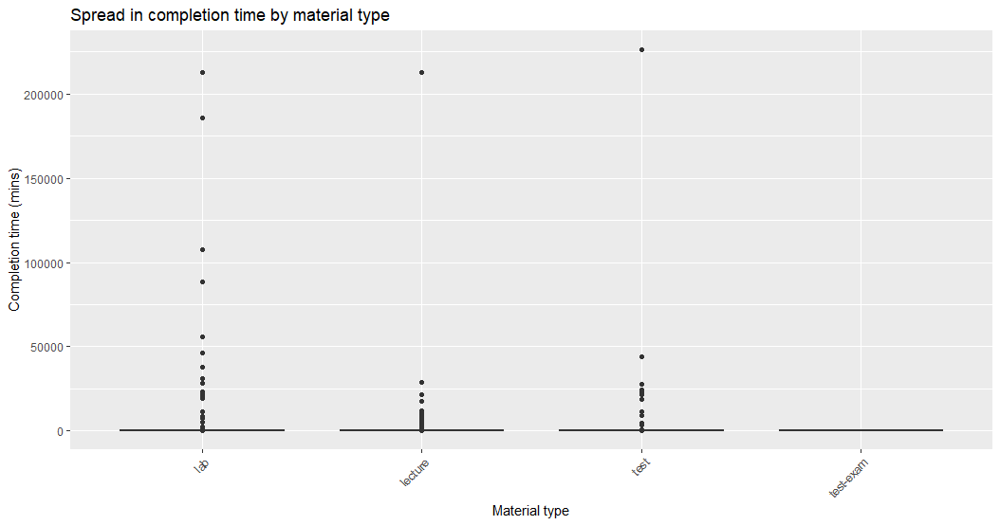
*Figure 1.1. Spread in completion time by material type*

| |  |  | 
|---------|-----------|------------|
|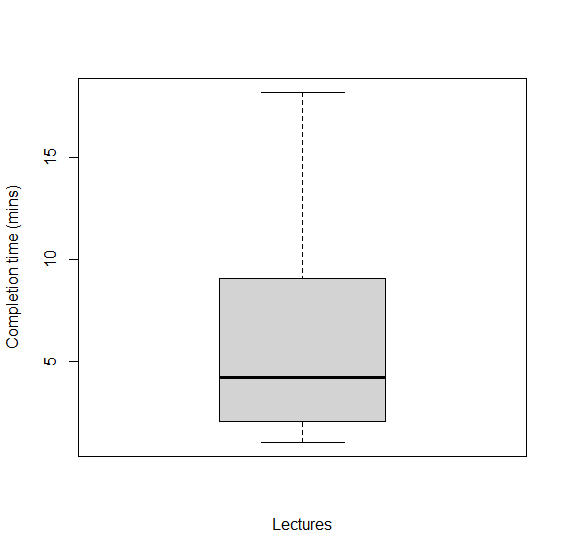   |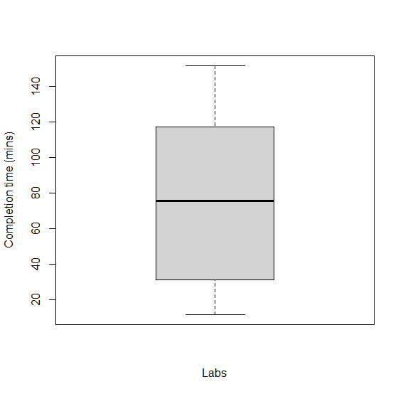   | 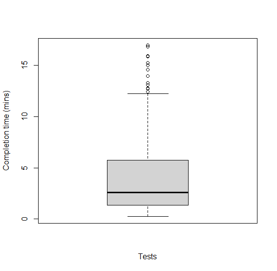   | 

*Figure 1.2. Spread in completion time after removing extreme outlines*

## Appendix 2: Visualizations of linear models for lectures

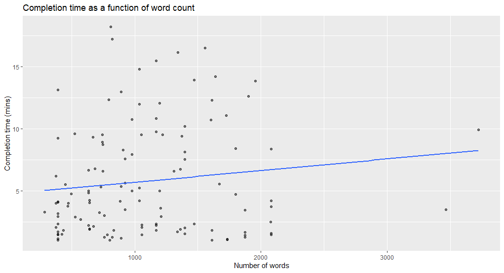
*Figure 2.1. Linear model for lectures completion time, depending on words count*

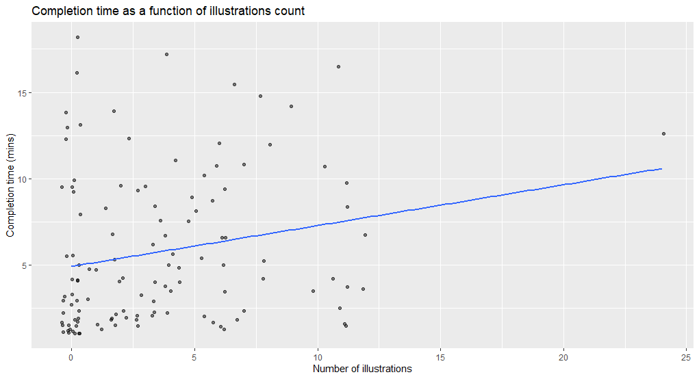
*Figure 2.2. Linear model for lectures completion time, depending on illustrations count*

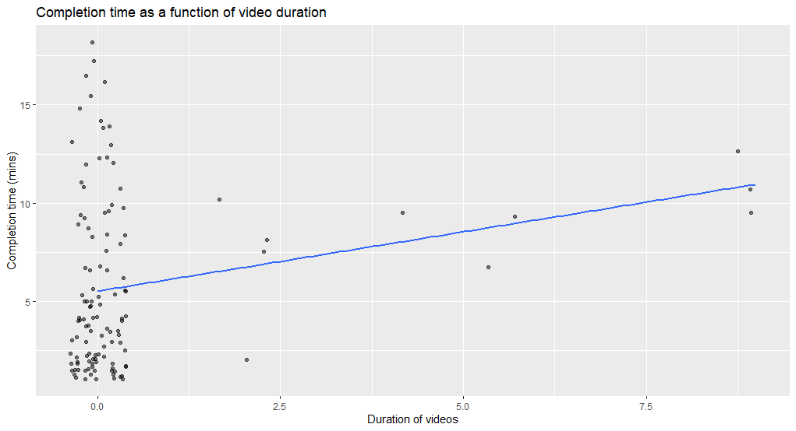
*Figure 2.3. Linear model for lectures completion time, depending on videos duration*

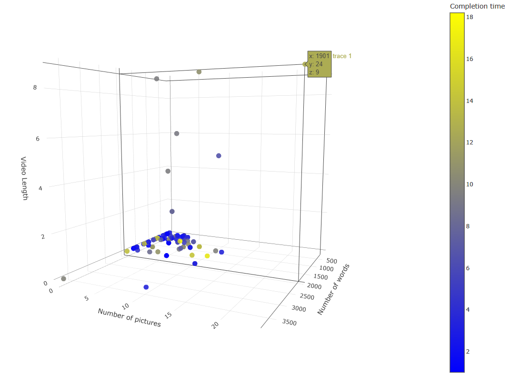
*Figure 2.4. 3D heatmap for lectures completion time, considering on all 3 features*

## Appendix 3: Visualizations of linear models for labs

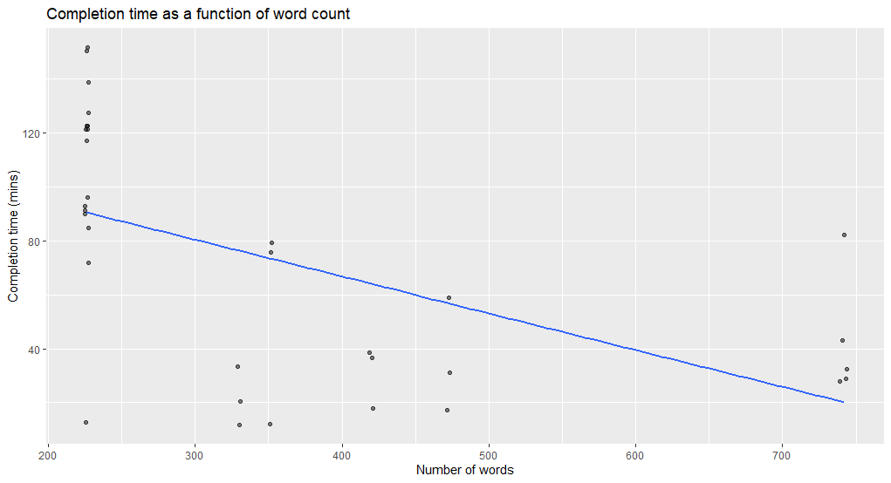
*Figure 3.1. Linear model for labs completion time, depending on words count*

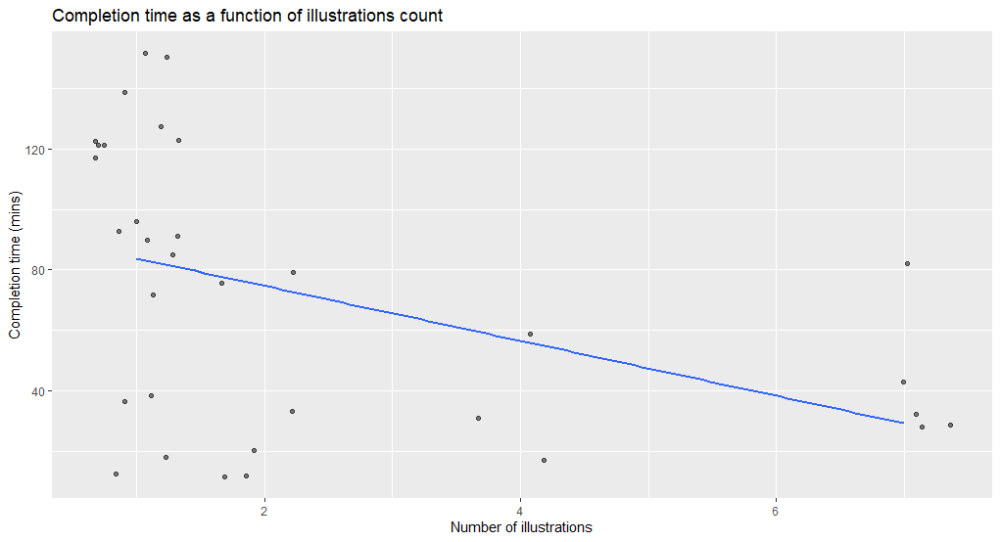
*Figure 3.2. Linear model for labs completion time, depending on illustrations count*

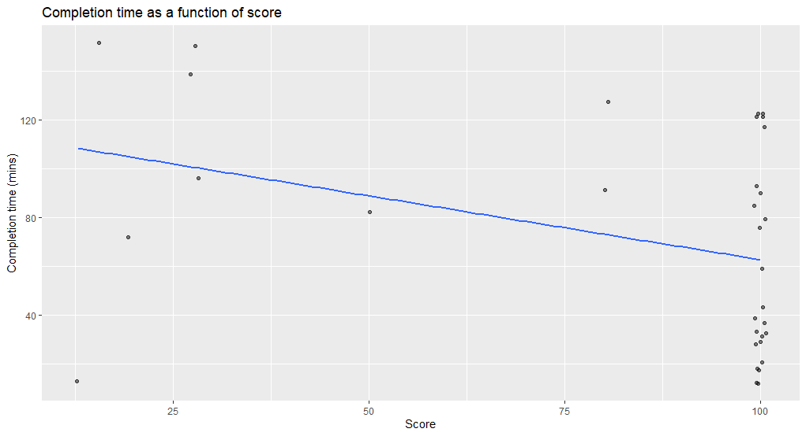
*Figure 3.3. Linear model for labs completion time, depending on score*

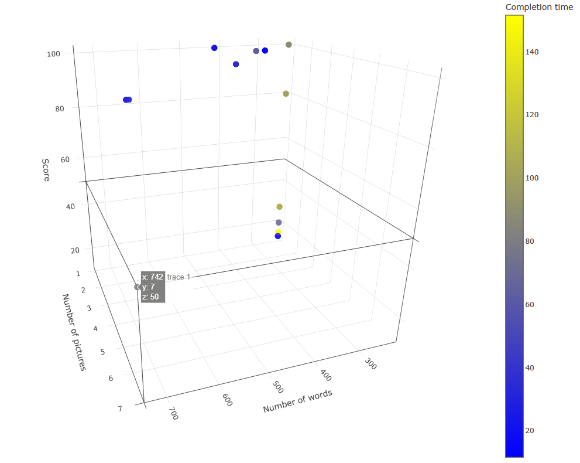
*Figure 3.4. 3D heatmap for labs completion time, considering on all 3 features*

## Appendix 4: Visualizations of linear models for tests

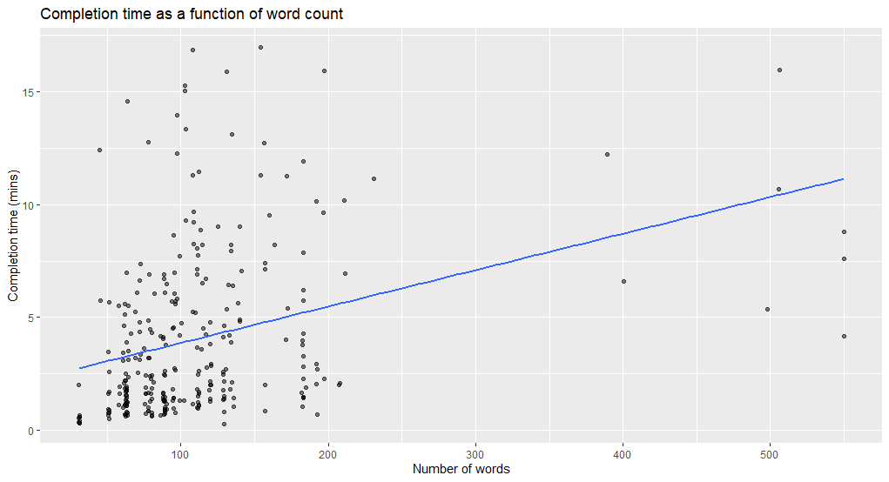
*Figure 4.1. Linear model for tests completion time, depending on words count*

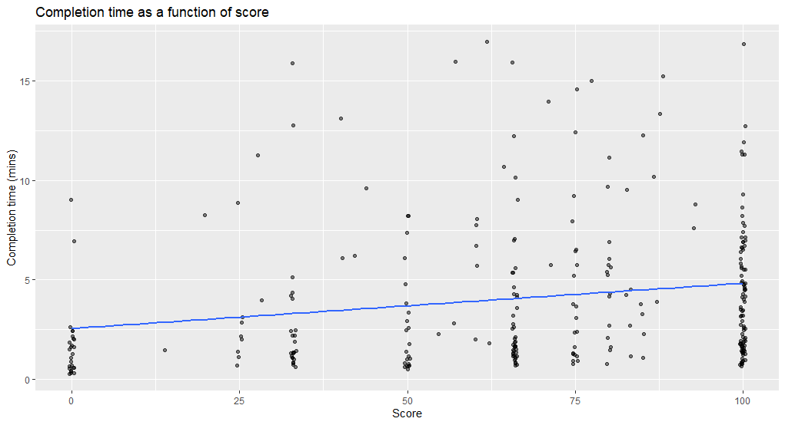
*Figure 4.2. Linear model for tests completion time, depending on score*

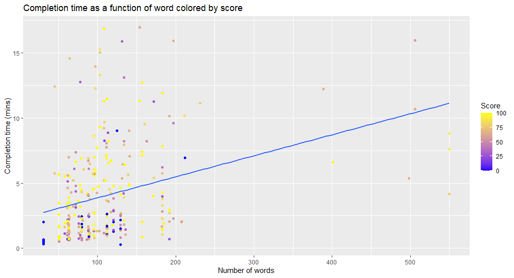
*Figure 4.3. Linear model for tests completion time, depending on words count, score colored*

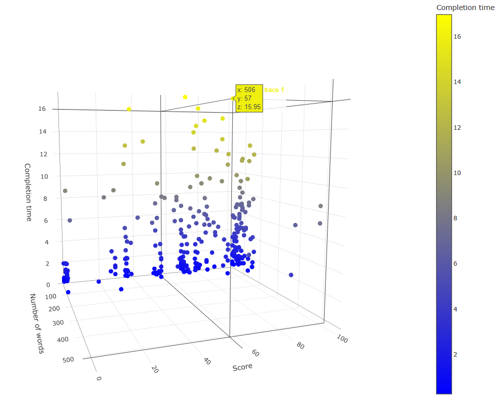
*Figure 4.4. 3D heatmap for tests completion time, considering words count and score*

## Appendix 5: Visualizations of model application

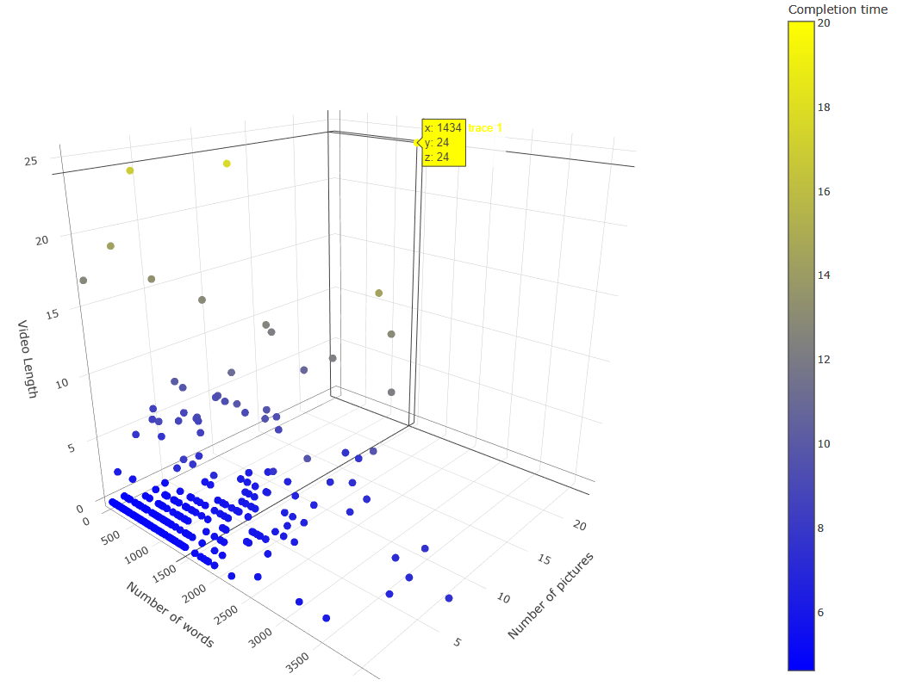
*Figure 5.1. 3D heatmap for predicted completion time for lectures considering 3 features*

| |  |  | 
|---------|-----------|------------|
|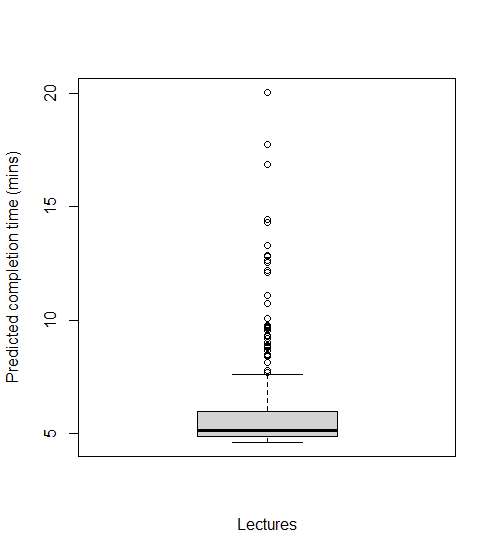   |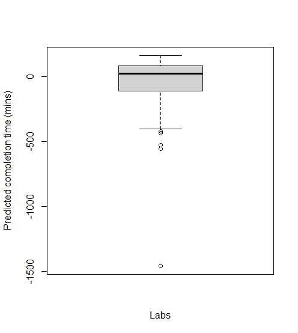   | 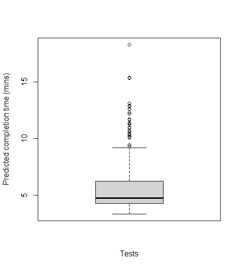   | 

*Figure 5.2. Spread in predicted completion time*
